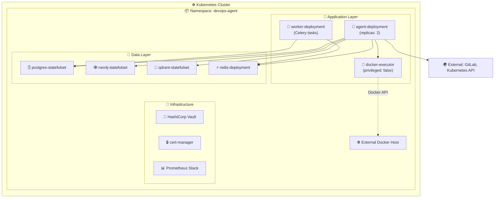

# 🤖 DevOps AI Agent — Kubernetes Deployment Guide

> **Статус**: 🟡 Активная разработка | **Обновлено**: Май 2026  
> Документация для развёртывания DevOps-AI-Agent в Kubernetes-кластере с соблюдением best practices безопасности.

---

## 📋 Оглавление

1. [Обзор архитектуры](#-обзор-архитектуры)
2. [Требования](#-требования)
3. [Быстрый старт](#-быстрый-старт)
4. [Конфигурация](#-конфигурация)
5. [Установка компонентов](#-установка-компонентов)
6. [Безопасность](#-безопасность)
7. [Мониторинг и логирование](#-мониторинг-и-логирование)
8. [Масштабирование](#-масштабирование)
9. [Troubleshooting](#-troubleshooting)
10. [CI/CD интеграция](#-cicd-интеграция)

---

## 🏗️ Обзор архитектуры



### Компоненты Kubernetes

| Компонент | Тип | Назначение | Реплики |
|-----------|-----|-----------|---------|
| `agent` | Deployment | Ядро AI-агента (LangGraph + LLM) | 2+ |
| `worker` | Deployment | Фоновые задачи (Celery) | 1-3 |
| `docker-executor` | Deployment | Изолированное выполнение Docker-команд | 1 |
| `postgres` | StatefulSet | Реляционное хранилище состояния | 1 (+репликация) |
| `neo4j` | StatefulSet | Graph memory для связей инцидентов | 1 (+репликация) |
| `qdrant` | StatefulSet | Vector store для семантического поиска | 1-3 |
| `redis` | Deployment | Broker для Celery + кэш сессий | 1 |

---

## ⚙️ Требования

### Кластер Kubernetes
```yaml
# Минимальные требования
kubernetes_version: ">= 1.28"
nodes:
  - role: control-plane
    cpu: "4"
    memory: "8Gi"
  - role: worker
    cpu: "8+"
    memory: "32Gi+"
    gpu: "NVIDIA RTX 4090 (24GB) — опционально, для vLLM"

# Требуемые CSI драйверы
storage_classes:
  - name: fast-ssd
    provisioner: kubernetes.io/no-provisioner # или cloud-provisioner
    reclaimPolicy: Retain
  - name: standard
    provisioner: kubernetes.io/no-provisioner
```

### Установленные операторы/инструменты
```bash
# Обязательные
kubectl >= 1.28
helm >= 3.12
cert-manager >= 1.12          # Для TLS-сертификатов
external-dns (опционально)    # Для автоматической регистрации DNS

# Рекомендуемые
vault-agent-injector >= 0.15  # Для управления секретами
prometheus-operator >= 0.65   # Для мониторинга
nvidia-device-plugin (если есть GPU)
```

### Проверка окружения
```bash
# Проверка доступа к кластеру
kubectl cluster-info
kubectl get nodes -o wide

# Проверка StorageClass
kubectl get storageclass

# Проверка GPU (если используется vLLM)
kubectl describe nodes | grep -i nvidia

# Проверка установленных CRD
kubectl get crd | grep -E "(certmanager|vault|prometheus)"
```

---

## 🚀 Быстрый старт

### Шаг 1: Подготовка пространства имён и RBAC
```bash
# Создать namespace с политиками безопасности
kubectl apply -f kubernetes/namespaces/devops-agent.yaml

# Создать ServiceAccount и роли
kubectl apply -f kubernetes/deployments/serviceaccount.yaml
kubectl apply -f kubernetes/deployments/docker-executor-sa.yaml

# Проверить
kubectl get ns devops-agent
kubectl get sa -n devops-agent
```

### Шаг 2: Настройка секретов и ConfigMaps
```bash
# 🔐 ВАЖНО: Никогда не храните секреты в git!

# Вариант 1: Создать секреты вручную
kubectl create secret generic postgres-secrets -n devops-agent \
  --from-literal=POSTGRES_PASSWORD="YourSecurePassword123!"

kubectl create secret generic neo4j-secrets -n devops-agent \
  --from-literal=NEO4J_PASSWORD="YourSecureNeo4jPass!"

kubectl create secret generic redis-secrets -n devops-agent \
  --from-literal=REDIS_PASSWORD="YourSecureRedisPass!"

# Вариант 2: Использовать HashiCorp Vault (рекомендуется)
# См. раздел "Безопасность" ниже

# Создать ConfigMap с настройками приложения
kubectl apply -f kubernetes/configmaps/agent-config.yaml
```

### Шаг 3: Установка хранилищ данных
```bash
# Применить манифесты хранилищ (порядок важен!)
kubectl apply -f kubernetes/storage/
kubectl apply -f kubernetes/deployments/postgres.yaml
kubectl apply -f kubernetes/deployments/neo4j.yaml
kubectl apply -f kubernetes/deployments/qdrant.yaml
kubectl apply -f kubernetes/deployments/redis.yaml

# Дождаться готовности
kubectl wait --for=condition=Ready pod -l app=postgres -n devops-agent --timeout=300s
kubectl wait --for=condition=Ready pod -l app=neo4j -n devops-agent --timeout=300s
```

### Шаг 4: Развёртывание приложения
```bash
# Применить сервисы и деплойменты
kubectl apply -f kubernetes/services/
kubectl apply -f kubernetes/deployments/agent.yaml
kubectl apply -f kubernetes/deployments/worker.yaml
kubectl apply -f kubernetes/deployments/docker-executor.yaml

# Проверить статус
kubectl get all -n devops-agent
kubectl rollout status deployment/agent -n devops-agent
```

### Шаг 5: Проверка работоспособности
```bash
# Проверить health endpoints
kubectl port-forward svc/agent 8080:8080 -n devops-agent &
curl -s https://localhost:8080/health | jq

# Проверить подключение к хранилищам
kubectl exec -it deploy/agent -n devops-agent -- \
  python -c "from agent.memory import HybridMemory; m=HybridMemory(); print('✅ Memory OK')"

# Тестовый запрос к агенту
curl -X POST https://localhost:8080/api/v1/query \
  -H "Content-Type: application/json" \
  -d '{"task": "Проверь подключение к базам данных", "mode": "advisory"}'
```

---

## 🔧 Конфигурация

### ConfigMap: `agent-config.yaml`
```yaml
apiVersion: v1
kind: ConfigMap
metadata:
  name: agent-config
  namespace: devops-agent
data:
  # === LLM Configuration ===
  LLM_API_BASE: "http://vllm-service:8000/v1"
  LLM_MODEL: "Qwen/Qwen2.5-14B-Instruct-AWQ"
  LLM_MAX_TOKENS: "8192"
  LLM_TEMPERATURE: "0.1"
  
  # === Agent Settings ===
  AGENT_MODE: "autonomous"  # autonomous | advisory
  MAX_RETRY: "3"
  CONFIDENCE_THRESHOLD: "0.7"
  SANDBOX_TIMEOUT: "120"
  
  # === Database URLs ===
  DATABASE_URL: "postgresql://devops@postgres:5432/devops_db"
  NEO4J_URI: "bolt://neo4j:7687"
  NEO4J_USER: "neo4j"
  QDRANT_URL: "http://qdrant:6333"
  REDIS_URL: "redis://redis:6379/0"
  
  # === External Services ===
  GITLAB_URL: "https://gitlab.dash-panel.tech"
  DOCKER_EXECUTOR_URL: "http://docker-executor:5001"
  
  # === Logging ===
  LOG_LEVEL: "INFO"
  AUDIT_LOG_PATH: "/var/log/agent/audit.jsonl"
```

### Environment Variables (через Secrets)
```bash
# Пароли и токены (создавать через kubectl create secret или Vault)
POSTGRES_PASSWORD          # Пароль к PostgreSQL
NEO4J_PASSWORD             # Пароль к Neo4j
REDIS_PASSWORD             # Пароль к Redis
GITLAB_TOKEN               # GitLab Personal Access Token (scopes: api, read_repository)
VAULT_TOKEN                # Токен Vault (если не используется agent-injector)

# Опциональные
OPENAI_API_KEY             # Если используется OpenAI вместо vLLM
SLACK_WEBHOOK_URL          # Для уведомлений в Slack
```

### Resource Limits (рекомендуемые)
```yaml
# agent-deployment
resources:
  requests:
    memory: "1Gi"
    cpu: "500m"
  limits:
    memory: "4Gi"  # Увеличить при использовании локальной LLM
    cpu: "2000m"

# docker-executor (минимальные привилегии)
resources:
  requests:
    memory: "128Mi"
    cpu: "100m"
  limits:
    memory: "512Mi"
    cpu: "500m"
securityContext:
  runAsNonRoot: true
  allowPrivilegeEscalation: false
  capabilities:
    drop: ["ALL"]
    add: ["NET_ADMIN"]  # Только если требуется для docker network
```

---

## 📦 Установка компонентов

### По отдельности
```bash
# 1. Infrastructure
kubectl apply -k kubernetes/overlays/production/infrastructure

# 2. Data layer
kubectl apply -k kubernetes/overlays/production/data

# 3. Application layer
kubectl apply -k kubernetes/overlays/production/app

# 4. Monitoring (опционально)
kubectl apply -k kubernetes/overlays/production/monitoring
```

### Через Kustomize (рекомендуется)
```bash
# Production overlay
kubectl apply -k kubernetes/overlays/production

# Staging overlay (с уменьшенными ресурсами)
kubectl apply -k kubernetes/overlays/staging

# Dev overlay (minikube/k3s)
kubectl apply -k kubernetes/overlays/dev
```

### Через Helm (альтернатива)
```bash
# Добавить репозиторий (если публикуется)
helm repo add devops-agent https://charts.dash-panel.tech
helm repo update

# Установить с базовыми настройками
helm install devops-agent devops-agent/devops-agent \
  --namespace devops-agent \
  --create-namespace \
  --values values.production.yaml

# Обновить конфигурацию
helm upgrade devops-agent devops-agent/devops-agent \
  --namespace devops-agent \
  --values values.production.yaml \
  --reuse-values
```

---

## 🔐 Безопасность

### 🔒 Подход Zero-Trust

```yaml
# 1. Pod Security Standards (enforced на уровне namespace)
apiVersion: v1
kind: Namespace
metadata:
  name: devops-agent
  labels:
    pod-security.kubernetes.io/enforce: restricted
    pod-security.kubernetes.io/audit: restricted
    pod-security.kubernetes.io/warn: restricted

# 2. Network Policies (запретить всё по умолчанию)
apiVersion: networking.k8s.io/v1
kind: NetworkPolicy
metadata:
  name: default-deny-all
  namespace: devops-agent
spec:
  podSelector: {}
  policyTypes:
  - Ingress
  - Egress
---
# Разрешить только необходимые соединения
apiVersion: networking.k8s.io/v1
kind: NetworkPolicy
metadata:
  name: allow-agent-to-databases
  namespace: devops-agent
spec:
  podSelector:
    matchLabels:
      app: agent
  policyTypes:
  - Egress
  egress:
  - to:
    - podSelector:
        matchLabels:
          app: postgres
    ports:
    - protocol: TCP
      port: 5432
  - to:
    - podSelector:
        matchLabels:
          app: neo4j
    ports:
    - protocol: TCP
      port: 7687
```

### 🔐 Управление секретами

#### Вариант 1: HashiCorp Vault (рекомендуется)
```yaml
# Аннотации для Vault Agent Injector в deployment/agent.yaml
annotations:
  vault.hashicorp.com/agent-inject: "true"
  vault.hashicorp.com/role: "devops-agent"
  vault.hashicorp.com/agent-inject-secret-creds.txt: "secret/data/devops/database"
  vault.hashicorp.com/agent-inject-template-creds.txt: |
    {{- with secret "secret/data/devops/database" -}}
    export POSTGRES_PASSWORD="{{ .Data.data.password }}"
    export NEO4J_PASSWORD="{{ .Data.data.neo4j_password }}"
    export GITLAB_TOKEN="{{ .Data.data.gitlab_token }}"
    {{- end }}
```

```bash
# Настроить Vault policy
vault policy write devops-agent - <<EOF
path "secret/data/devops/*" {
  capabilities = ["read"]
}
path "secret/data/devops/database" {
  capabilities = ["read"]
}
EOF

# Создать роль для Kubernetes auth
vault write auth/kubernetes/role/devops-agent \
  bound_service_account_names=devops-agent-sa \
  bound_service_account_namespaces=devops-agent \
  policies=devops-agent \
  ttl=24h
```

#### Вариант 2: Kubernetes Secrets (с шифрованием etcd)
```bash
# Включить шифрование секретов в etcd (kubeadm)
# /etc/kubernetes/encryption-config.yaml
apiVersion: apiserver.config.k8s.io/v1
kind: EncryptionConfiguration
resources:
  - resources:
      - secrets
    providers:
      - aescbc:
          keys:
            - name: key1
              secret: <base64-encoded-32-byte-key>
      - identity: {}
```

### 🛡️ Security Context для всех подов
```yaml
securityContext:
  runAsNonRoot: true
  runAsUser: 1000
  runAsGroup: 1000
  fsGroup: 1000
  allowPrivilegeEscalation: false
  capabilities:
    drop:
      - ALL
  seccompProfile:
    type: RuntimeDefault
```

### 🔍 Аудит и логирование
```bash
# Включить audit logging на уровне кластера
# /etc/kubernetes/audit-policy.yaml
apiVersion: audit.k8s.io/v1
kind: Policy
rules:
- level: RequestResponse
  resources:
  - group: ""
    resources: ["pods", "secrets", "configmaps"]
  namespaces: ["devops-agent"]

# Просмотр аудита
kubectl logs -n kube-system kube-apiserver-* | grep devops-agent
```

---

## 📊 Мониторинг и логирование

### Prometheus Metrics
```bash
# Endpoint: https://agent.devops-agent.svc.cluster.local:8080/metrics

# Ключевые метрики:
agent_request_duration_seconds{endpoint="/api/v1/query"}
agent_confidence_score_bucket
agent_fixes_total{status="success|failed"}
memory_retrieval_latency_seconds{store="neo4j|qdrant"}
vllm_gpu_memory_utilization
docker_executor_commands_total{status="allowed|denied"}
```

### Grafana Dashboards
```bash
# Импорт дашборда
kubectl apply -f monitoring/dashboards/devops-agent.json

# Или через Helm values:
grafana:
  dashboards:
    devops-agent:
      url: https://raw.githubusercontent.com/senyka/DevOps-AI-Agent/main/monitoring/dashboards/devops-agent.json
      datasource: Prometheus
```

### Логи (Loki/Fluentd)
```yaml
# Пример конфигурации fluent-bit для сбора логов
apiVersion: fluentbit.fluent.io/v1alpha2
kind: ClusterFluentBitConfig
metadata:
  name: devops-agent-logging
spec:
  service:
    parsersFile: parsers.conf
  inputSelector:
    matchLabels:
      namespace: devops-agent
  filterSelector:
    matchLabels:
      app: fluent-bit-filter-mask
  outputSelector:
    matchLabels:
      app: loki-output
```

### Health Checks
```bash
# Liveness probe (agent)
GET /health
Response: {"status": "healthy", "components": {"postgres": "ok", "neo4j": "ok", ...}}

# Readiness probe (agent)
GET /ready
Response: {"ready": true, "llm_loaded": true, "memory_initialized": true}

# Metrics
GET /metrics
# Prometheus-format metrics
```

---

## 📈 Масштабирование

### Горизонтальное масштабирование агента
```bash
# Увеличить реплики агента
kubectl scale deployment agent -n devops-agent --replicas=5

# Или через HPA (автоматическое масштабирование)
kubectl apply -f kubernetes/hpa/agent-hpa.yaml

# Пример HPA конфигурации
apiVersion: autoscaling/v2
kind: HorizontalPodAutoscaler
metadata:
  name: agent-hpa
  namespace: devops-agent
spec:
  scaleTargetRef:
    apiVersion: apps/v1
    kind: Deployment
    name: agent
  minReplicas: 2
  maxReplicas: 10
  metrics:
  - type: Resource
    resource:
      name: cpu
      target:
        type: Utilization
        averageUtilization: 70
  - type: Pods
    pods:
      metric:
        name: requests_per_second
      target:
        type: AverageValue
        averageValue: "10"
```

### Масштабирование хранилищ
```bash
# Qdrant (stateless, можно масштабировать)
kubectl scale statefulset qdrant -n devops-agent --replicas=3

# Neo4j (требует кластерной лицензии для масштабирования)
# Рекомендуется: 1 primary + read replicas

# PostgreSQL (через оператор, например, Zalando PG Operator)
kubectl patch postgresql devops-db -n devops-agent \
  --type merge -p '{"spec":{"numberOfInstances":3}}'
```

### Resource Quotas для namespace
```yaml
apiVersion: v1
kind: ResourceQuota
metadata:
  name: devops-agent-quota
  namespace: devops-agent
spec:
  hard:
    requests.cpu: "20"
    requests.memory: 40Gi
    limits.cpu: "40"
    limits.memory: 80Gi
    persistentvolumeclaims: "10"
    secrets: "20"
    configmaps: "20"
    pods: "30"
```

---

## 🛠️ Troubleshooting

### Агент не запускается / CrashLoopBackOff
```bash
# Проверить логи
kubectl logs -n devops-agent deploy/agent --previous
kubectl logs -n devops-agent deploy/agent -c agent

# Проверить зависимости
kubectl exec -it -n devops-agent deploy/agent -- \
  curl -v http://postgres:5432
kubectl exec -it -n devops-agent deploy/agent -- \
  curl -v http://neo4j:7687

# Проверить секреты
kubectl get secret -n devops-agent | grep -E "(postgres|neo4j|redis)"
kubectl describe secret postgres-secrets -n devops-agent
```

### Проблемы с подключением к LLM/vLLM
```bash
# Проверить доступность vLLM сервиса
kubectl get svc -n devops-agent | grep vllm
kubectl exec -it -n devops-agent deploy/agent -- \
  curl -v http://vllm-service:8000/v1/models

# Проверить загрузку модели (если локальная)
kubectl logs -n devops-agent deploy/vllm | grep -i "loading\|error"

# Увеличить timeout для инициализации
kubectl patch deployment agent -n devops-agent \
  --type json -p '[{"op":"replace","path":"/spec/template/spec/containers/0/livenessProbe/initialDelaySeconds","value":60}]'
```

### Docker Executor не выполняет команды
```bash
# Проверить allowlist команд
kubectl exec -it -n devops-agent deploy/docker-executor -- \
  env | grep ALLOWED_COMMANDS

# Проверить логи executor
kubectl logs -n devops-agent deploy/docker-executor

# Проверить права доступа к Docker socket (если используется host)
kubectl describe pod -n devops-agent -l app=docker-executor | grep -A5 volumes

# ⚠️ Внимание: docker.sock не должен монтироваться в production!
# Используйте remote Docker API или kaniko для сборки образов
```

### Проблемы с памятью (Neo4j / Qdrant)
```bash
# Проверить использование памяти
kubectl top pods -n devops-agent

# Увеличить лимиты для Neo4j
kubectl patch statefulset neo4j -n devops-agent \
  --type json -p '[{"op":"replace","path":"/spec/template/spec/containers/0/resources/limits/memory","value":"8Gi"}]'

# Проверить хранилище
kubectl get pvc -n devops-agent
kubectl describe pvc neo4j-data-devops-agent-0 -n devops-agent
```

### Сброс состояния (крайняя мера)
```bash
# ⚠️ WARNING: Это удалит все данные!
# Создать бэкап перед выполнением
kubectl exec -n devops-agent postgres-0 -- pg_dump -U devops devops_db > backup.sql

# Удалить PVC (данные хранилищ)
kubectl delete pvc -n devops-agent -l app=postgres
kubectl delete pvc -n devops-agent -l app=neo4j
kubectl delete pvc -n devops-agent -l app=qdrant

# Пересоздать поды
kubectl delete pod -n devops-agent -l app=postgres
kubectl delete pod -n devops-agent -l app=neo4j
kubectl delete pod -n devops-agent -l app=qdrant
```

---

## 🔄 CI/CD Интеграция

### Пример для GitLab CI (gitlab.dash-panel.tech)
```yaml
# .gitlab-ci.yml
stages:
  - test
  - build
  - deploy

variables:
  KUBE_CONTEXT: "production"
  NAMESPACE: "devops-agent"

test:
  stage: test
  image: python:3.11-slim
  script:
    - pip install -r agent/requirements.txt
    - pytest tests/ --cov=agent
  artifacts:
    reports:
      coverage_report:
        coverage_format: cobertura
        path: coverage.xml

build-agent:
  stage: build
  image: docker:24.0
  services:
    - docker:24.0-dind
  script:
    - docker build -t $CI_REGISTRY/agent:$CI_COMMIT_SHA ./agent
    - docker push $CI_REGISTRY/agent:$CI_COMMIT_SHA
  only:
    - main

deploy-production:
  stage: deploy
  image: bitnami/kubectl:latest
  script:
    # Обновить образ в kustomize
    - cd kubernetes/overlays/production
    - kustomize edit set image devops-agent=$CI_REGISTRY/agent:$CI_COMMIT_SHA
    # Применить изменения
    - kubectl apply -k . --context=$KUBE_CONTEXT
    # Дождаться развёртывания
    - kubectl rollout status deployment/agent -n $NAMESPACE --context=$KUBE_CONTEXT
  environment:
    name: production
    url: https://agent.dash-panel.tech
  only:
    - main
  when: manual  # Требует ручного подтверждения
```

### GitOps с ArgoCD
```yaml
# argocd/applications/devops-agent.yaml
apiVersion: argoproj.io/v1alpha1
kind: Application
metadata:
  name: devops-agent
  namespace: argocd
spec:
  project: default
  source:
    repoURL: https://gitlab.dash-panel.tech/tr0jan/devops-agent.git
    path: kubernetes/overlays/production
    targetRevision: HEAD
  destination:
    server: https://kubernetes.default.svc
    namespace: devops-agent
  syncPolicy:
    automated:
      prune: true
      selfHeal: true
    syncOptions:
    - CreateNamespace=true
    - PrunePropagationPolicy=foreground
  ignoreDifferences:
  - group: apps
    kind: Deployment
    jsonPointers:
    - /spec/replicas
```

---

## 📚 Дополнительные ресурсы

- [Kubernetes Best Practices](https://kubernetes.io/docs/concepts/configuration/overview/)
- [Pod Security Standards](https://kubernetes.io/docs/concepts/security/pod-security-standards/)
- [HashiCorp Vault on Kubernetes](https://developer.hashicorp.com/vault/docs/platform/k8s)
- [Prometheus Operator](https://github.com/prometheus-operator/prometheus-operator)
- [Kustomize Documentation](https://kubectl.docs.kubernetes.io/)

---

## 🗃️ История версий Kubernetes манифестов

| Версия | Дата | Изменения |
|--------|------|-----------|
| `k8s/v0.2.0` | 2026-05-07 | 🔐 Добавлены NetworkPolicies, обновлены securityContext, интеграция с Vault |
| `k8s/v0.1.1` | 2026-05-05 | 🛡️ Исправлены уязвимости: добавлены podSecurityContext, dropped capabilities |
| `k8s/v0.1.0` | 2026-05-01 | 🎉 Initial Kubernetes manifests: deployments, services, namespaces |

---

> ⚠️ **Важно**: Этот README актуален для версии `v0.2.0`. Перед применением в production обязательно:
> 1. Протестируйте в staging-окружении
> 2. Проверьте совместимость с вашей версией Kubernetes
> 3. Адаптируйте resource limits под вашу инфраструктуру
> 4. Настройте backup для stateful-компонентов (PostgreSQL, Neo4j, Qdrant)
